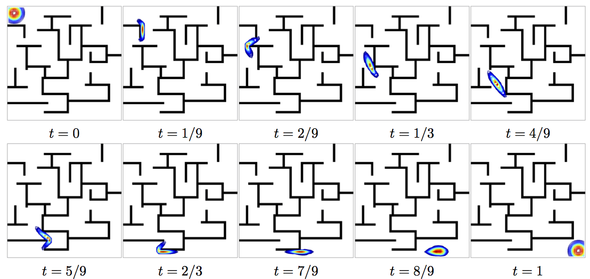

This Matlab package contains the source code to reproduce the figure of the article:

N. Papadakis, G. Peyré, E. Oudet. [Optimal Transport with Proximal Splitting](https://hal.archives-ouvertes.fr/hal-00816211). SIAM Journal on Imaging Sciences, 7(1), pp. 212–238, 2014. 

Copyright (c) 2009 Gabriel Peyré

=============
Description

This archive contains the Douglas-Rachford (DR) and Primal-Dual (PD) solvers applied to the Benamou-Brenier (BB) problem discretized on a staggered grid.

They can be tested with:

* test_bb_dr.m: DR algorithm.
* test_bb_pd.m: DR algorithm.

=============
Principal options

The principal options are the following:

1) chose your test case with

> test = 'gaussian';

(you can create your own scenario by defining f0 and f1 the initial and final densities)

2) chose the dimension of the problem:

> N=32; P=32; Q=32;  

(N and P are the discrete spatial dimensions and Q is the temporal discretization)

3) Parameterization of the solver:

For DR:

> mu = 1.98; % should be in ]0,2[
> gamma = 1./230.; % should be >0
> niter = 1000;

For PD:

> sigma=85;
> niter = 1000;  %  (increase the maximum number of iteration to have better results)

4) Generalized cost functions:

Minimize \sum_k w_k f_k^\alpha |v_k|^2

> alpha= 1; % should be in [0;1];

alpha=1 computes the L2-Wasserstein distance, 0 is for the H^-1 one and intermediate values gives interpolations between the norms

> obstacle=zeros(N,P,Q);

Define the points of the 3D volume where the mass can not pass. For instance, setting

> obstacle(N/2,P/2,:)=1;

will create an obstacle in the middle of the spatial domain.

=============
Exemples of settings:

> test = 'gaussian';
> N=32; P=32; Q=32;  
> niter = 200;

> test = 'obstacle';
> niter = 2000;
